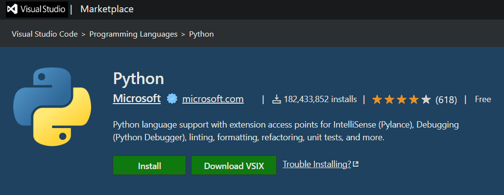

# VS Marketplace: Download VSIX Button

[](https://greasyfork.org/scripts/your-script-id)

This Tampermonkey/Greasemonkey userscript adds a **"Download VSIX"** button right next to the official green **Install** button on [Visual Studio Marketplace](https://marketplace.visualstudio.com/) extension pages.

The new button is:
- **Identical in style** to the Install button (cloned from it, same size, color, and hover effects).
- Always positioned **right beside** the Install button with a small space in between.
- Linked directly to the **latest VSIX package** for offline installation.
- **Persistent** — if the Marketplace uses SPA navigation or re-renders the page, the button is re-injected automatically.

---

## ✨ Features

- **Exact style match**: The Download button is cloned from the real Install button so it looks native.
- **No API calls or scraping**: The link is built directly from the extension’s `itemName` in the page URL.
- **Direct download**: Click to immediately download the `.vsix` file for the latest version.
- **SPA-safe**: Works even when navigating between extensions without a full page reload.

---

## 🔗 Example

For the Python extension at:  
`https://marketplace.visualstudio.com/items?itemName=ms-python.python`

The script generates a download link to:  
```

[https://marketplace.visualstudio.com/\_apis/public/gallery/publishers/ms-python/vsextensions/python/latest/vspackage](https://marketplace.visualstudio.com/_apis/public/gallery/publishers/ms-python/vsextensions/python/latest/vspackage)

```

---

## 📥 Installation

1. Install a userscript manager if you don’t already have one:
   - [Tampermonkey](https://www.tampermonkey.net/) (recommended)
   - [Violentmonkey](https://violentmonkey.github.io/)
   - [Greasemonkey](https://www.greasespot.net/) (not as well tested)

2. Install this script from [Greasy Fork](https://greasyfork.org/scripts/your-script-id).

3. Visit any Visual Studio Marketplace extension page — the **Download VSIX** button will appear right next to Install.

---

## 🖼 Screenshot



---

## ⚙ How It Works

- Reads the `publisher.extension` ID from the page URL.
- Constructs a `latest/vspackage` download link for that extension.
- Clones the existing Install button’s HTML/CSS, updates its text and `href`, and inserts it beside Install.
- Keeps the button injected on all SPA navigations and re-renders.

---

## License

This project is licensed under the [GNU General Public License v3.0](LICENSE).

---

Developed with ❤️ by [Brandon Henness](https://github.com/brandonhenness)
